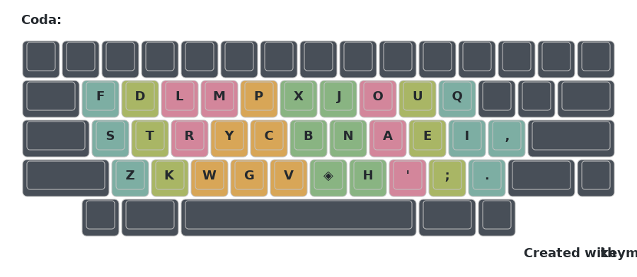
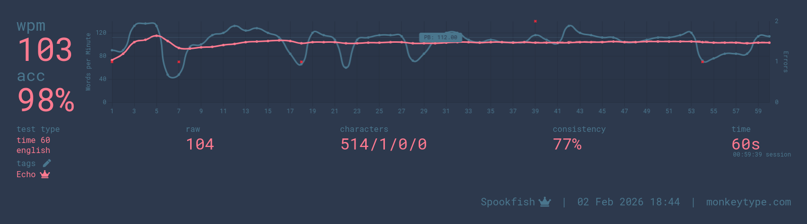

# ECHO

Echo is a high performance alternate keyboard layout that leverages a 'magic' key to break through certain unavoidable limitations faced by traditional layouts. It doesn't require thumb keys or an expensive keyboard, you can use it anywhere you can install your own software. It was designed from the ground up with magic in mind using tools like Oxeylyzer with a repeat corpus, and Mana for analysis.

It uses a nonstandard fingermap to take full advantage of rowstagger as demonstrated in this image, however this also means Echo is completely non-viable for colstag boards.



```
Echo | monkeyracer
  f d l m p x j o u q
  s t r y c b n a e i ,
  z k w g v * h ' ; .

Magic rules: ao cc dd ee ff gg hh ii jj ks ll mm oo pp qq rr ss tt ue vv ww xx yp zz ..

Heatmap score: 74.346%
Handbalance: 43.782% / 56.218%

Alt: 37.63%
Rolls (Total): 54.49%
  Inroll: 23.216%
  Outroll: 29.257%
  In3roll: 1.056%
  Out3roll: 0.96%
Redirect (+sfs): 6.172%
  Redirect (Weak) (+sfs): 0.513%

┌────────────────┬──────────┬────────────┬─────────────┐
│                │  bigram  │  skipgram  │  skipgram2  │
├────────────────┼──────────┼────────────┼─────────────┤
│  same finger   │  0.608%  │  6.284%    │  8.475%     │
│  repeat        │  0.107%  │  3.091%    │  --         │
│  stretch       │  2.445%  │  5.209%    │  3.291%     │
│  half scissor  │  1.535%  │  1.832%    │  1.456%     │
│  full scissor  │  0.245%  │  0.773%    │  1.039%     │
└────────────────┴──────────┴────────────┴─────────────┘
```
For reference, on the same corpus, non magic layouts have a repeat bigram rate of 2.828%.

(stats via Mana, notably redirect stats in Mana include SFS rediects)

# Magic?

A 'magic' key is a key that produces a different output in different situations (\* represents the magic key). In most cases, the most useful output will be a repeat of the previous key, so "l*" outputs "ll" (fixing otherwise unavoidable 'same finger repeats'). Some keys don't ever repeat, or do so extremely rarely. In those cases we can look for other uses such as "u*" -> "ue", which fixes a 'same finger bigram' found in many modern layouts. You can also override a key with frequent repeats if you feel there is a more useful sequence. The default rules are intended to be uncontroversial and easy to learn.

We can go beyond single letter magic and have "y*" -> "you", or "b*" -> "because". Similarly we can broaden the context our magic rules consider and take into account multiple previous key presses. Within Kanata we do this via 'key-history' to set rules such that "u*" -> "ue", but "ou*" -> "ou'".

While this enables a great degree of complexity, even simple rules can substantially improve the typing experience.

# The fingermap

Originally pioneered by StronglyTyped (see: [Graphite](https://github.com/rdavison/graphite-layout)) for the layout Nokwts, the goal of this fingermap is to assign a finger to a region of the keyboard rather than a strict column. In Echo we take advantage of this to map three relatively high usage keys 'rlm' to the strong middle finger without causing high vertical movement. Instead the middle finger can hover around this triangle of keys, able to easily hit any of them in quick succession. Unrelated to the fingermap, there's a similar effect on the right index. It mostly hits 'nh\*b', only rarely reaching to the top row for the low usage 'jx'.

# Alt fingerings

The biggest SFB is '\*n', which for this layout would occur on 'oon' 'een', etc. This is a very nice alt if you hit '\*' with index and 'n' with middle. Doing this alt brings the total SFBs below 0.5%. However if you're particularly sensitive to redirects you may prefer to tank it. You can do a similar alt to type 'nn' with the magic key, leaving 'bb' as the only repeat typed manually.

There are a large number of low frequency alts available between the left middle and left index fingers, thanks in part to the fingermap. For these examples 'I' = Index and 'M' = middle, so 'cy' -> IM means you hit c with index and y with middle.

cy -> IM
gy -> IM
lm -> MI
rm -> MI
rl -> IM

That should give you an idea though more are possible. If you find an SFB on those fingers and you enjoy alts, you can probably find something.

# Are repeats even a big deal?

This is ultimately a personal decision, but I'll present my reasons for concluding that they are.

The SFB (same finger bigram) is widely accepted as the worst stat because you're bottlenecked by waiting for a single finger to act twice in a row. A repeat *is* a same finger bigram, there's just no movement so we could call it a 0u SFB. It's counter intuitive but some people type 0u SFBs *slower* than 1u sfbs, this could be influenced by the type of keyboard being used. To get a first hand sense of how fast you type 0u SFBs I recommend spending some time on [zippywords](https://zippywords.com). See how fast you type repeats and how comfortable you find hitting them as fast as possible. Some of the fastest Qwerty typists are also adding a repeat to their layout on Capslock and/or a punctuation key to reach increasingly absurd speeds.

Modern layouts reach SFB rates under 0.8% but have their repeat rates pinned at 2.8%\~. Assuming no alts Echo totals 0.715% for both. With the alts I use the total is 0.2%\~.

# How do I use it?

See [here](kanata/README.md/) for details.

# Acknowledgements

Thank you to Oxey (see:[Oxeylyzer](https://github.com/O-X-E-Y/oxeylyzer)) and Zak (see:[Mana](https://github.com/Zakkkk/mana)) for their tools that drastically sped up my iteration time, Nova (Kanata config repo coming soon) for trying an earlier version and giving feedback, and the AKL discord in general for being a helpful friendly place.

Some other magic layouts that don't require thumb keys are [Graphyre](https://gitlab.com/paulmorris/keyboard-layouts/-/blob/main/Graphyre/README.md) and [Vylet](https://github.com/MightyAcas/vylet). Both of which place much lower emphasis on repeats.

And here's my current Echo 60s PB:


